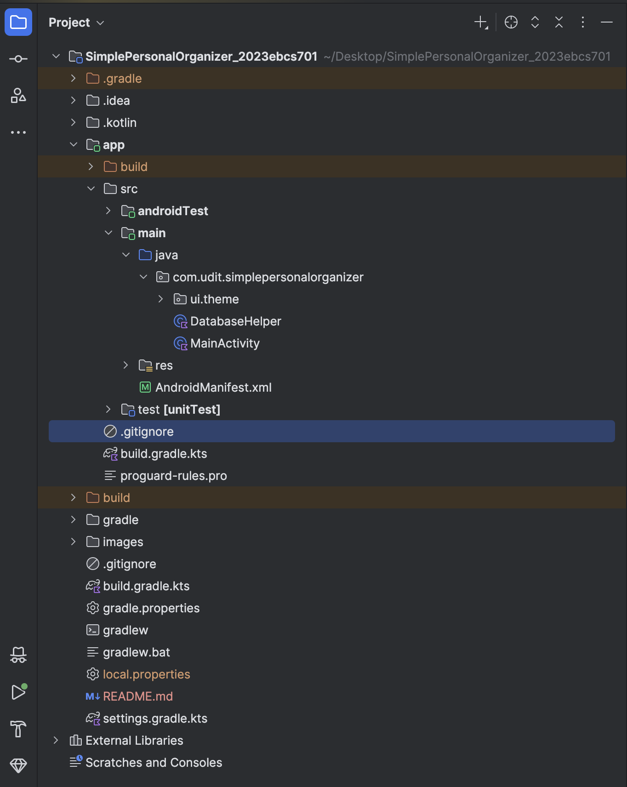
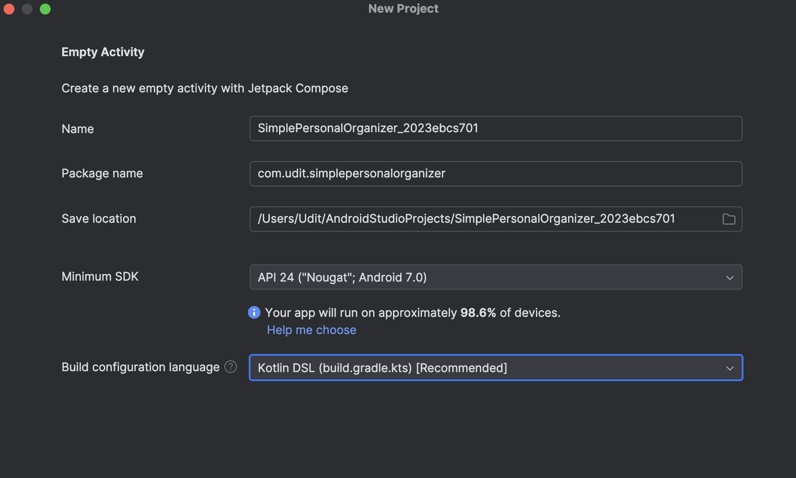
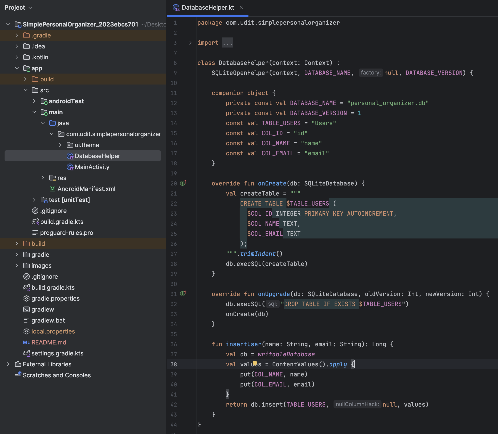

# Simple Personal Organizer

## Question A: Set up the Simple Personal Organizer Project
- [X] Name the Project as SimplePersonalOrganizer_2023ebcs701
- [X] Empty Activity template + project targets API level 24 (Nougat) or higher.
- [X] Configure package name and app settings
- [X] DatabaseHelper: database helper class
- [X] Define User Table (id, name, email)

### Deliverable
- [X] Project Structure Screenshot
- [X] Configuration Screenshot
- [X] DatabaseHelper class code Screenshot

#### File Structure

#### Configuration

Please refer to `app/build.gradle.kts` to get app-level Gradle configuration.

#### DatabaseHelper class
