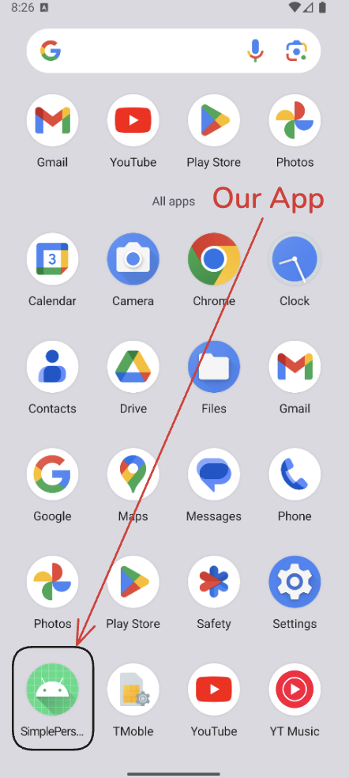
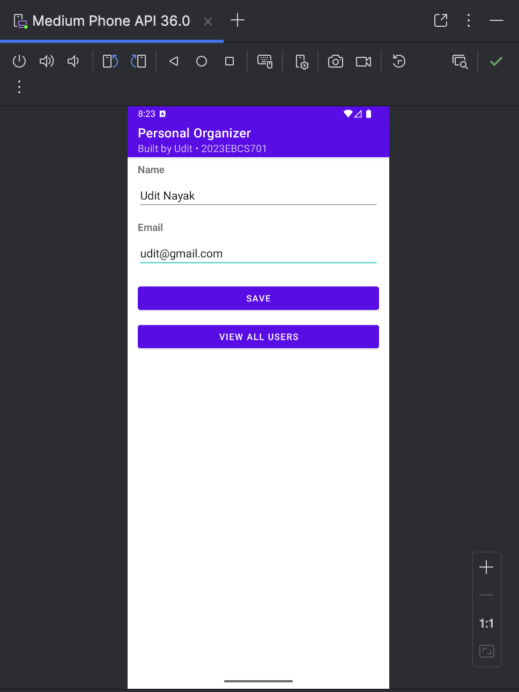
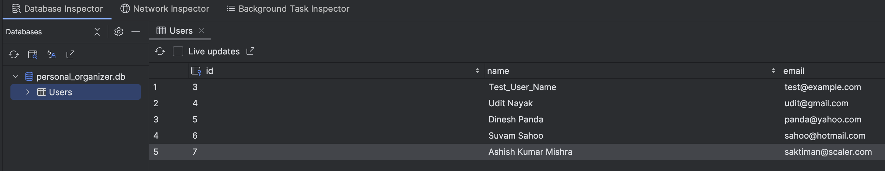

# Simple Personal Organizer

## Question A: Set up the Simple Personal Organizer Project
- [X] Name the Project as SimplePersonalOrganizer_2023ebcs701
- [X] Empty Activity template + project targets API level 24 (Nougat) or higher.
- [X] Configure package name and app settings
- [X] DatabaseHelper: database helper class
- [X] Define User Table (id, name, email)

### Deliverable
- [X] Project Structure Screenshot
- [X] Configuration Screenshot
- [X] DatabaseHelper class code Screenshot

#### File Structure

#### Configuration

Please refer to `app/build.gradle.kts` to get app-level Gradle configuration.

#### DatabaseHelper class

## Question B: Design the Information Form
- [X] EditText elements + TextView labels
- [X] Save Button
- [X] Basic styling (padding + margin)
- [X] Display a success message upon saving the data.

### Deliverable:
- [X] XML layout file (activity_main.xml)
- [X] MainActivity.kt file
- [X] screenshot of the form showing sample data saved in the database

#### Preview on Device

#### Information Form Layout (UI)

#### Confirmation Message on Save

#### Stored Data Verification (Database View)

